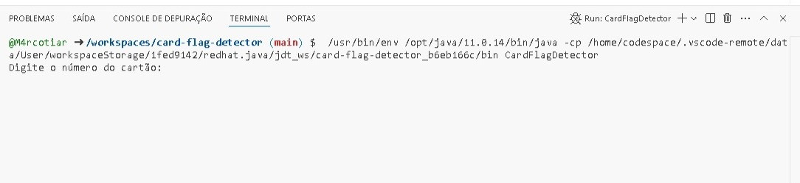
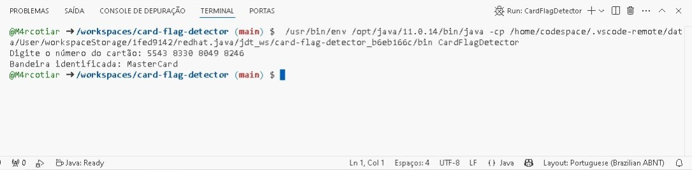

# 💳 Card Flag Detector - Java

Projeto desenvolvido como parte do desafio da DIO para identificar a bandeira de cartões de crédito com base no número digitado. A aplicação foi escrita em Java e utiliza expressões regulares para detectar as principais bandeiras.

## 🚀 Funcionalidades

- Identificação de várias bandeiras de cartão a partir do número digitado.
- Suporte às seguintes bandeiras:
  - Visa
  - MasterCard
  - American Express
  - Diners Club
  - Discover
  - enRoute
  - JCB
  - Voyager
  - HiperCard
  - Aura
  - 
## 💳 Exemplo de Execução

### 📥 Entrada do Usuário
Abaixo está um exemplo de input no terminal com o número do cartão:



### 📤 Saída do Programa
Aqui está o resultado exibido pelo programa:



## 🛠️ Tecnologias utilizadas

- Java 8+
- Git e GitHub

## ▶️ Como executar

1. Clone o repositório:
```bash
git clone https://github.com/seu-usuario/card-flag-detector-java.git
cd card-flag-detector-java
